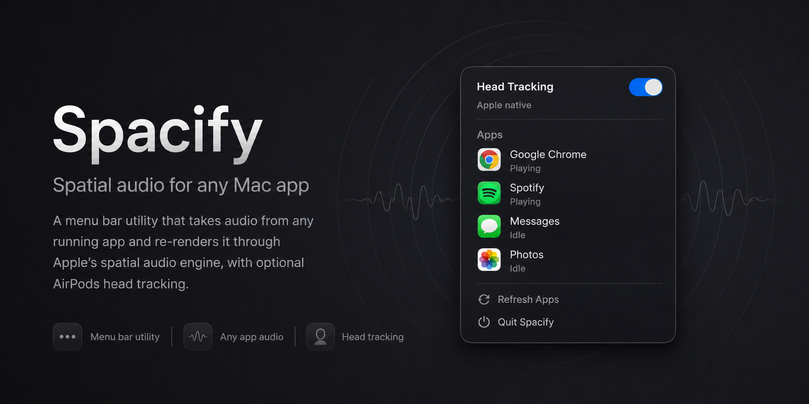

# Spacify

<p align="center"></p>

**Spatial audio for any Mac app.** Spacify is a menu bar utility that takes the sound of any running app — Spotify, Chrome, a game, anything CoreAudio can see — and re-renders it through Apple's own spatial audio engine, with optional AirPods head tracking. Apps that were never built for Spatial Audio suddenly sound like they were.

## What it does

Click the waveform icon in the menu bar, flip the switch next to an app, and that app's stereo audio is lifted out of its normal playback path and re-rendered by `AUSpatialMixer` — the same spatializer Apple uses for its own Spatial Audio features:

- **Works with any audio app.** If it shows up in CoreAudio, it can be spatialized: streaming clients, browsers, games, video calls. Select several apps at once and they share one tap.
- **Native AirPods head tracking.** One switch asks Apple's mixer to anchor the sound stage in front of you using the AirPods' own motion engine. Spacify never touches the motion data itself.
- **Adapts to your output.** Headphones get the binaural HRTF render (personalized HRTF in auto mode where available); built-in and external speakers each get Apple's matching speaker profile.
- **Follows your devices.** Pop your AirPods in or out and active routing rebuilds itself on the new default output automatically.
- **Remembers your setup.** App selections and the head-tracking preference persist across launches; routing resumes by itself if the apps are running.
- **No double audio.** Tapped apps are muted at the system level while routed, so you only ever hear the spatialized feed.

What it deliberately does **not** do: EQ, gain, compression, limiting, reverb tweaks, stereo widening, crossfeed, or any custom DSP. The audio you hear is Apple's spatial render of the original stream — nothing else. A fixed "clean music" profile keeps the mixer honest: stereo input stays an ambience bed, default reverb wetness is disabled, playback rate is locked at 1.0.

## Why it exists

There is no public API to force Apple Spatial Audio *inside* another signed app — Spotify on macOS, for example, simply doesn't offer it. Spacify takes the workable route instead: capture the app's audio at the CoreAudio process level, mute the original, and run the stream through Apple's spatializer in a helper process. Same engine, same head tracking — just rendered one step downstream.

## Quick start

```sh
make app    # build the .app bundle
make run    # launch the menu bar app
```

Requires macOS 14.2+ (Core Audio Process Taps) and the Xcode command line tools. macOS will ask for **System Audio Recording** permission on first use — that's the process tap.

Then: click the waveform icon → toggle an app → listen. `make run-head` launches with head tracking pre-enabled regardless of the saved preference.

Diagnostics:

```sh
make list               # print every CoreAudio-visible app and its processes
make run-spotify        # terminal-only Spotify render path
make run-spotify-head   # same, with head tracking
make test               # run the test suite
```

## How it works

```
 Selected apps                Spacify helper process                    Output device
┌──────────────┐   ┌─────────────────────────────────────────────┐   ┌──────────────┐
│ Spotify      │   │  Core Audio Process Tap                     │   │ AirPods /    │
│ Chrome       ├──▶│  (stereo mixdown, originals muted)          │   │ speakers     │
│ …            │   │                │                            │   │              │
└──────────────┘   │                ▼                            │   │              │
                   │  AUSpatialMixer (UseOutputType, HRTF,       ├──▶│              │
                   │  optional AirPods head tracking)            │   │              │
                   │                │                            │   │              │
                   │                ▼                            │   │              │
                   │  Layout bridge (zero-copy / vDSP)           │   │              │
                   └─────────────────────────────────────────────┘   └──────────────┘
```

1. **Discovery.** `AudioProcessResolver` enumerates CoreAudio process objects, maps them back to their owning `.app` bundles (with cached bundle metadata), and groups multi-process apps — a Chromium browser's many helper processes appear as one menu entry.
2. **Capture.** Toggling apps creates one shared `CATapDescription(stereoMixdownOfProcesses:)` process tap with `muteBehavior = .mutedWhenTapped`, so the originals go silent while tapped.
3. **Routing.** A private aggregate device wraps the current default output and the tap (`kAudioAggregateDeviceTapAutoStartKey`), clocked by the output device with tap drift compensation off. An IO proc on a `userInteractive` dispatch queue drives the render.
4. **Spatialization.** `AUSpatialMixer` is configured once at route start: `UseOutputType` spatialization, ambience-bed source mode, the output type inferred from the device (headphones / built-in / external speakers), personalized HRTF in auto mode (macOS 13+), and native head tracking via `kAudioUnitProperty_SpatialMixerEnableHeadTracking` when enabled.
5. **Delivery.** The mixer's planar float output is bridged to whatever buffer layout the device expects and written straight into the IO proc's output buffers.

Selection changes, head-tracking restarts, and device switches all rebuild the route through a single debounced path (120 ms), and a replacement route is started before the previous one is stopped, so toggles don't click or drop audio.

### The real-time path

The render callback runs ~100× per second on an audio thread, so the hot path is built to do as close to nothing as possible:

- **Zero-copy first.** When the tap delivers planar stereo float, the mixer's pull callback hands the tap buffers to the mixer by pointer — no copy. When the output device buffers are already planar, the mixer renders directly into them — no scratch buffer.
- **vDSP for the rest.** Where layouts genuinely differ (interleaved ↔ planar), conversion is a single SIMD `vDSP_ctoz`/`vDSP_ztoc` call; matching layouts use `memcpy`. The worst case per cycle is two vDSP calls.
- **Real-time hygiene.** No allocations, no locks, no Objective-C weak loads in the callback: the IO proc captures the mixer strongly (the proc is destroyed before the mixer is released), and scratch buffers are preallocated for the maximum slice size.
- **Graceful degradation.** Any unexpected buffer shape falls back to a generic per-sample bridge, and render failures output silence rather than garbage.

### Project layout

| Path | What it is |
|---|---|
| `Sources/SpotifyNativeSpatialCore` | Platform-free render core: `AppleSpatialMixerRenderer`, the fixed spatial profile, the buffer bridge, output-kind inference |
| `Sources/SpotifyNativeSpatial` | The app: menu bar UI (MacControlCenterUI), process discovery, tap/aggregate lifecycle, device-change observer, CLI entry points |
| `Tests/SpotifyNativeSpatialCoreTests` | Buffer-bridge correctness (exact sample values), mixer configuration, profile invariants, and source-level guards that keep the render path free of custom DSP |
| `tools/make_app_icon.sh` | Regenerates `Resources/AppIcon.icns` |

The test suite includes *purity guards* — source-inspection tests that fail if anyone reintroduces post-processing, manual head-pose math, or mixer mutation on a live route. The hands-off render path is enforced, not just promised.

## Limitations

- The AirPods Spatial Audio menu may not list the original app as supported content — that app is still its own CoreAudio client, and what you hear is the helper-rendered monitor feed.
- CoreAudio exposes process-level audio, not browser-tab identity. Spacify can spatialize a browser's audio, not one arbitrary tab.
- `make app` ad-hoc signs the bundle, which is fine locally; distributing to other Macs requires Developer ID signing and notarization.
